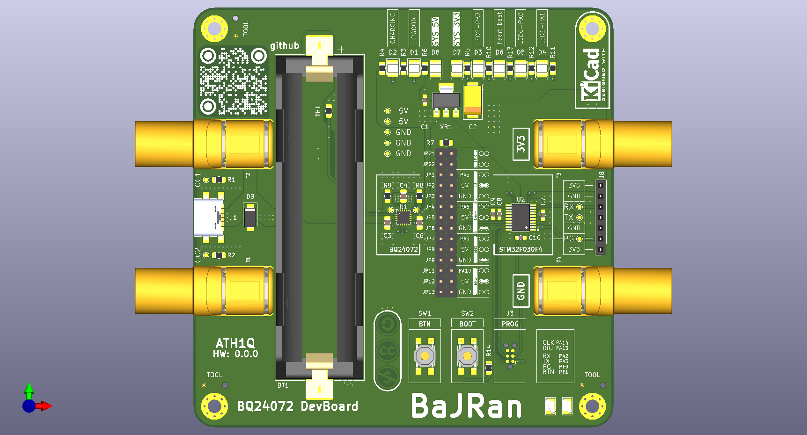
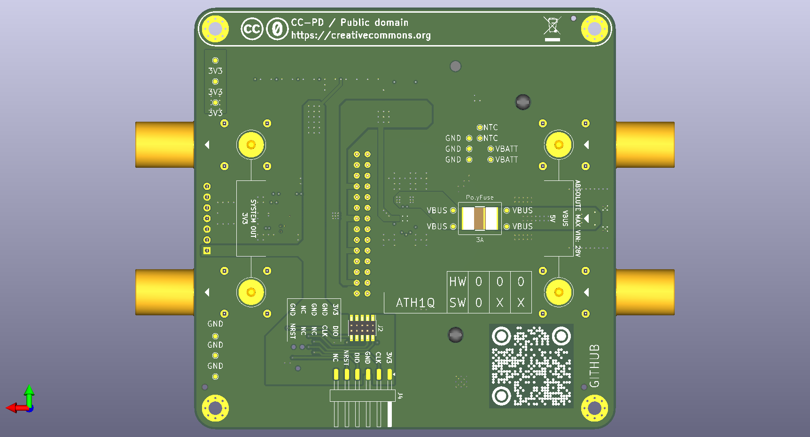

<!-- Begin README -->

    
    

f

    
    
    
     

> [!NOTE]
> TODO:

> [!NOTE]
> **SW:**

    

    

<!-- VARIANTS SECTION -->
<!-- VARIANTS SECTION -->
<!-- VARIANTS SECTION -->

<!-- GALLERY SECTION -->
<!-- GALLERY SECTION -->
<!-- GALLERY SECTION -->

---

    
    

<!-- End README -->
<!-- github background #0d1117 -->